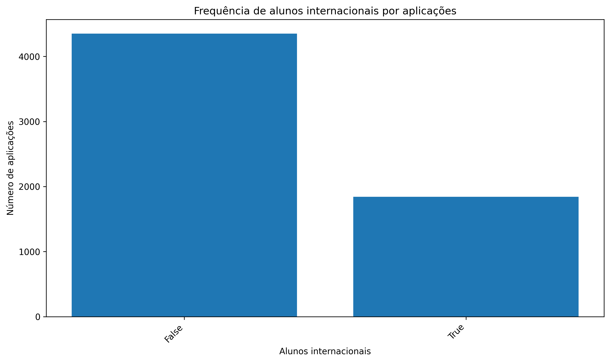
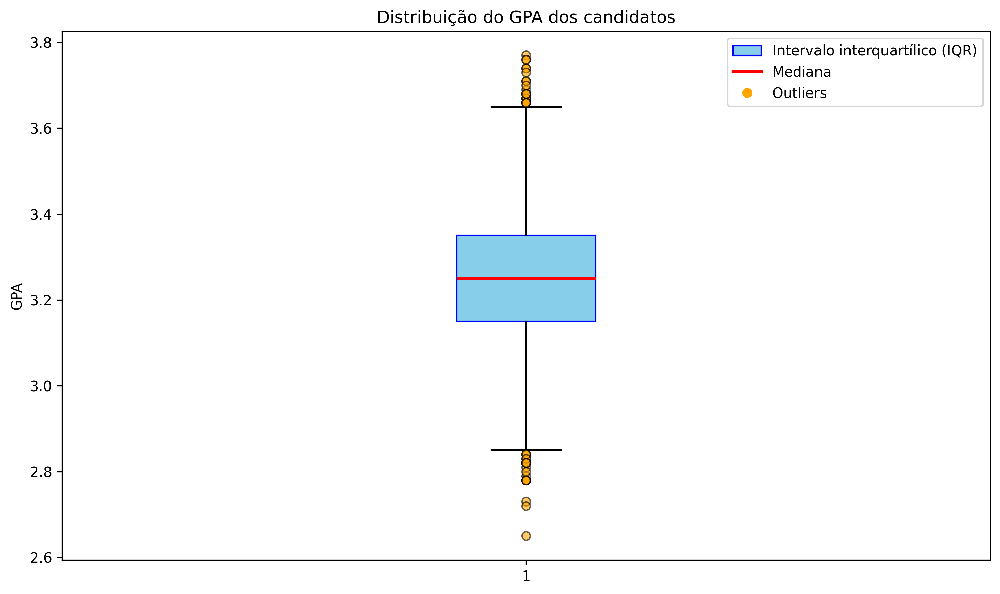
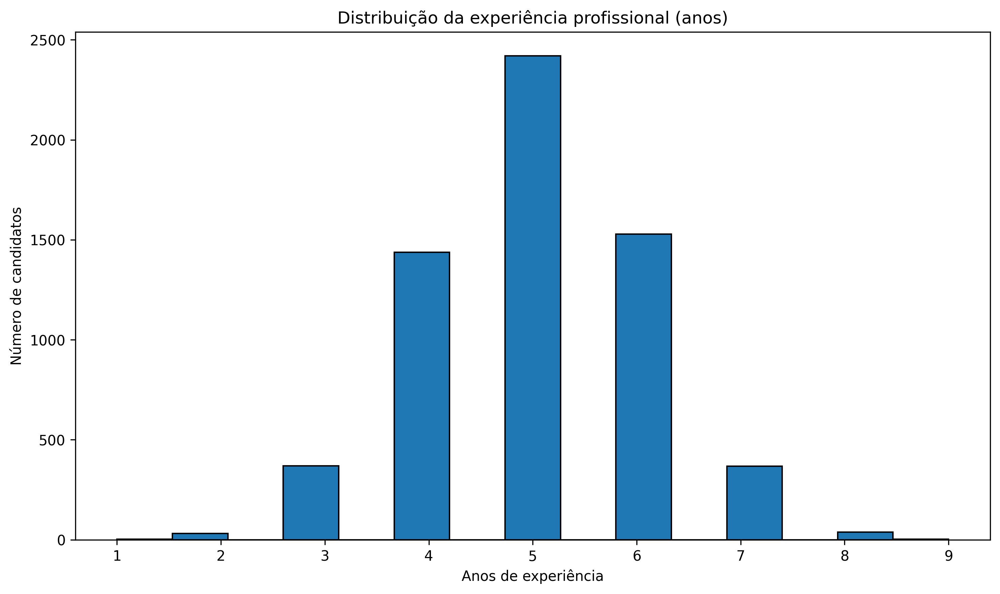

## Introdução
O modelo de Métricas e Avaliação tem como objetivo analisar o desempenho dos algoritmos aplicados à base de admissões de MBA, fornecendo medidas quantitativas que permitem interpretar a qualidade das previsões realizadas. Para isso, são utilizadas métricas clássicas de classificação, como acurácia, precisão, recall e F1-Score, além da matriz de confusão, que detalha os acertos e erros por classe. Esses indicadores são essenciais para identificar pontos fortes e limitações do modelo, especialmente em bases que apresentam certo desbalanceamento entre as categorias de admissão. Dessa forma, o uso das métricas garante uma avaliação mais completa e confiável, servindo de apoio para a comparação entre diferentes algoritmos já aplicados, como Árvore de Decisão, KNN e K-Means.

## Base de dados
A [base](https://www.kaggle.com/datasets/taweilo/mba-admission-dataset) utilizada é composta por dados sintéticos criados a partir das estatísticas da turma de 2025 do MBA de Wharton. Ela reúne informações demográficas, acadêmicas e profissionais de candidatos, como gênero, nacionalidade, área de formação, desempenho no GPA e no GMAT, além de experiência de trabalho e setor de atuação. Esses atributos foram relacionados ao status final da candidatura, categorizado como admitido, em lista de espera ou negado. Por se tratar de um conjunto de dados diversificado, é possível observar tanto os aspectos objetivos ligados ao desempenho acadêmico e profissional quanto elementos contextuais que podem influenciar o resultado do processo seletivo. Essa combinação torna o dataset especialmente relevante para análises exploratórias e para o desenvolvimento de modelos preditivos que buscam compreender os critérios implícitos de seleção em admissões de MBA.

=== "gender"
    A variável gênero apresenta uma diferença significativa na quantidade de aplicações. Observa-se uma predominância de candidatos do sexo masculino em comparação às candidatas do sexo feminino, o que indica uma distribuição desigual nesse aspecto. Essa discrepância pode refletir tendências do mercado de MBA ou características específicas da base gerada. Além disso, é um fator importante a ser considerado no modelo, já que possíveis vieses de gênero podem influenciar tanto a análise quanto as previsões de admissão.

    

=== "international"
    A variável alunos internacionais mostra que a maior parte das aplicações é de candidatos domésticos (não internacionais), enquanto os estudantes internacionais representam uma parcela menor do total. Essa diferença pode indicar que os programas de MBA ainda têm maior procura local, embora o número de aplicações internacionais seja relevante para demonstrar a diversidade e a atratividade global da instituição. Essa característica pode influenciar o modelo de predição, visto que fatores como origem do aluno podem estar relacionados às taxas de aceitação.

    

=== "gpa"
    A variável GPA apresenta distribuição concentrada em torno de valores relativamente altos, entre 3.1 e 3.3, o que indica que a maior parte dos candidatos possui desempenho acadêmico consistente. A mediana situa-se pouco acima de 3.2, reforçando esse padrão. Observa-se ainda a presença de alguns valores atípicos, tanto abaixo de 2.8 quanto acima de 3.6, que representam candidatos com desempenho fora do perfil predominante. Esses outliers, embora pouco frequentes, podem influenciar a análise estatística e devem ser considerados no pré-processamento ou na interpretação dos resultados do modelo. De forma geral, a distribuição do GPA sugere que a base é composta majoritariamente por candidatos academicamente fortes, o que pode ser um dos critérios determinantes no processo de admissão.

    

=== "major"
    A variável major, que representa a área de formação acadêmica dos candidatos, apresenta distribuição relativamente equilibrada entre as categorias, mas com destaque para Humanidades, que concentra o maior número de aplicações. As áreas de STEM e Business aparecem em proporções semelhantes, ambas com menor participação em relação a Humanidades. Essa diferença pode refletir o perfil da amostra, indicando maior procura de candidatos oriundos de cursos de Humanidades pelos programas de MBA. A análise dessa variável é relevante para verificar se determinadas formações acadêmicas têm maior representatividade ou desempenham papel diferenciado nos resultados de admissão.

    

=== "race"
    A variável raça apresenta distribuição diversificada entre os candidatos, com destaque para a categoria de pessoas que preferiram não se identificar, seguida pelo grupo White. Em seguida aparecem Asian, Black e Hispanic, enquanto a categoria Other concentra a menor quantidade de aplicações. Essa composição evidencia tanto a representatividade de diferentes origens raciais quanto a limitação do campo para candidatos internacionais. A análise dessa variável é importante para compreender a diversidade do conjunto de dados e avaliar se há possíveis diferenças de perfil que podem influenciar nos resultados de admissão.

        

=== "gmat"
    A variável GMAT apresenta uma distribuição concentrada entre 600 e 700 pontos, faixa onde se encontra a maior parte dos candidatos. O pico de frequência ocorre próximo de 650 pontos, o que sugere que esse valor é representativo do desempenho médio dos aplicantes. Apesar dessa concentração, também há candidatos com pontuações mais baixas, em torno de 570, bem como outros que alcançam notas elevadas acima de 750, embora em menor quantidade. Essa distribuição indica que, em geral, os candidatos possuem desempenho sólido no exame, mas com variação suficiente para permitir que o modelo identifique padrões relacionados ao status de admissão.

    

=== "work_exp"
    A variável experiência profissional apresenta distribuição concentrada entre 4 e 6 anos de atuação no mercado, com destaque para os candidatos que possuem 5 anos de experiência, que representam a maior parte das aplicações. Os extremos da distribuição, com candidatos que possuem apenas 1 ou 2 anos de experiência e aqueles com mais de 7 anos, aparecem em menor número, configurando perfis menos frequentes na amostra. Esse padrão sugere que a base de dados está composta principalmente por profissionais em estágio intermediário de carreira, o que reflete o perfil típico de aplicantes a programas de MBA. Essa variável é particularmente relevante, pois pode influenciar diretamente nas chances de admissão, uma vez que a experiência prática é um critério valorizado nas seleções.

    

=== "work_industry"
    A variável setor de experiência profissional revela que a maior parte dos candidatos possui trajetória em Consultoria, que se destaca amplamente em relação aos demais setores. Em seguida aparecem PE/VC (Private Equity e Venture Capital), Tecnologia e setores ligados ao serviço público ou organizações sem fins lucrativos, todos com participação significativa. Áreas tradicionais como Investment Banking e Financial Services também se mostram relevantes, mas em menor proporção. Já setores como Saúde, Bens de Consumo (CPG), Mídia/Entretenimento, Varejo, Imobiliário e Energia aparecem de forma mais restrita, representando nichos específicos da amostra. Essa distribuição indica que o MBA atrai predominantemente profissionais de consultoria e finanças, mas também apresenta diversidade ao incluir candidatos de áreas emergentes e de setores menos tradicionais.

    
    
## Matriz de Confusão
=== "KNN"
    ```python exec="on" html="1"    
    --8<-- "docs/knn/matriz_knn.py"
    ```
    
    Esse gráfico apresenta a matriz de confusão do modelo KNN, permitindo visualizar o desempenho do classificador em cada classe da variável admission. Observa-se que a maior parte dos acertos está concentrada na classe 0 (Deny), onde o modelo classificou corretamente 999 candidatos. Já para as classes 1 (Waitlist) e 2 (Admit), o número de acertos foi consideravelmente menor, com alguns exemplos sendo confundidos principalmente como classe 0. Isso evidencia que o modelo tem boa performance em identificar candidatos não admitidos, mas encontra maior dificuldade em diferenciar os casos de lista de espera e admissão, o que pode estar relacionado ao desbalanceamento entre as classes.

=== "K-Means"
    ```python exec="on" html="1"
    --8<-- "docs/k-means/matriz_k-means.py"
    ```
    
    O gráfico mostra as matrizes de confusão do modelo K-Means, avaliando como os clusters formados se relacionam com as classes reais da variável admission.

    Na primeira matriz (classes vs clusters), observa-se que os candidatos foram distribuídos entre três grupos, mas sem uma correspondência clara com as classes verdadeiras (Admit, Waitlist e Deny). Isso é confirmado pelo Adjusted Rand Index (0.0417), que indica baixa similaridade entre clusters e rótulos reais.

    Já na segunda matriz (clusters mapeados → classes), após o mapeamento dos clusters para as classes majoritárias, percebe-se que quase todos os exemplos foram atribuídos à classe 0 (Deny), ignorando as demais. Esse resultado demonstra a limitação do K-Means em capturar a estrutura real dos dados, com forte viés para a classe dominante, o que também é refletido pelo Silhouette Score baixo (0.1321).

    Em resumo, o K-Means não conseguiu separar adequadamente os grupos de candidatos, reforçando que algoritmos supervisionados (como o KNN) são mais eficazes para este problema.

## Métricas

=== "KNN"
    O modelo KNN apresentou uma acurácia de 83,8%, mostrando bom desempenho na previsão da classe Deny, com alta precisão (0,86) e recall (0,96). No entanto, teve dificuldades em identificar corretamente as classes Waitlist e Admit, com métricas baixas ou nulas. A matriz de confusão evidencia que a maioria dos erros ocorreu na confusão entre candidatos admitidos e negados, além da ausência de acertos na classe Waitlist.

=== "K-Means"
    O K-Means obteve resultados limitados, com Silhouette Score de 0,13 e Adjusted Rand Index de 0,04, indicando baixa qualidade de agrupamento em relação às classes reais. A matriz de confusão mostra que os clusters não conseguiram diferenciar adequadamente as categorias, concentrando a maioria dos exemplos na classe Deny. Esses resultados refletem as limitações do K-Means em problemas supervisionados de classificação.

## Comparação dos Resultados
Na comparação entre os modelos, o KNN apresentou desempenho superior ao K-Means. O KNN alcançou acurácia de 83,8%, sendo eficiente principalmente na identificação da classe Deny, ainda que com dificuldades em diferenciar Waitlist e Admit. Já o K-Means, com Silhouette Score de 0,13 e Adjusted Rand Index de 0,04, demonstrou baixa capacidade de agrupamento, evidenciando que o modelo não conseguiu refletir adequadamente as classes reais. Dessa forma, enquanto o KNN se mostrou mais adequado para a tarefa de classificação supervisionada, o K-Means teve desempenho limitado, reforçando seu uso mais apropriado em cenários de exploração ou agrupamento não supervisionado.